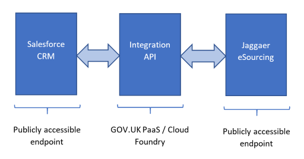
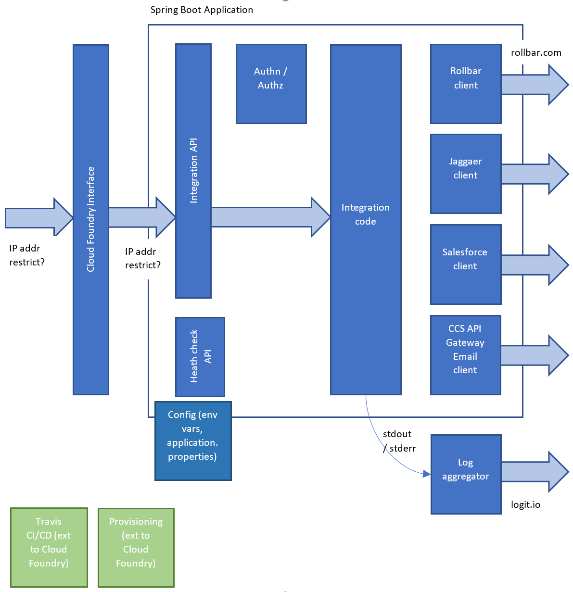

# CCS ESourcing Integration (API)

## Introduction

The CCS ESourcing Integration API project provides integration and mapping between the CCS Salesforce and Jaggaer Sourcing platforms.

It "sits" between CCSs Salesforce CRM and CCSs Jaggaer eSourcing applications. The Salesforce and Jaggaer applications may call, via REST endpoints the Integration API and the Integration API will translate the call and the data as required before calling the other application. In some cases, the Integration API may poll one of the services for updated information and then call the other application.

The name "Integration API" is misnomer as this will consist of an Integration API and an implementation of the API in other words an Integration Service.



The APIs exposed and used by the application are all defined using OpenAPI definitions. These definitions are available as downloadable resources allowing ease of use with tools such as SmartBears Swagger UI.



## Prerequisites
The application can de developed and built on Windows, Linux or MacOS.

The application is written in Java and requires Java 11+. AdoptOpenJDK version jdk-11.0.7.10-hotspot was used for development.

The project is built and managed using Maven. Maven version 3.6.3 was used during development.

The project is written in Java and was developed using both Eclipse or IntelliJ IDEs

Recommended Eclipse installation

+ Eclipse 2020-09
+ Bndtools plugin (so can open jars and wars files)
+ SpotBugs plugin
+ EasyShell plugin (so can open Windows Explorer and/or Command Prompt)

Recommended IntelliJ installation:

+ IntelliJ Idea 2020.3
+ Maven Helper plugin
+ SonarLint plugin
+ Swagger plugin
+ Google Java Format plugin

Eclipse and IntelliJ must be configured to use same source code formatting rules to ensure that no changes/diffs are introduced due to IDE reformatting. 

Java code formatting should follow the Google Java Code style as defined here https://google.github.io/styleguide/javaguide.html and supported tooling can be installed standalone or into the IDE as described here https://github.com/google/google-java-format. The Eclipse the coding style configuration is available here [eclipse-java-google-style.xml](./dev/resources/eclipse-java-google-style.xml)

Static analysis is performed using SpotBugs in the maven build.

The Cloud Foundry CLI tools can be installed according to the Cloud Foundry CLI [installation instructions](https://docs.cloudfoundry.org/cf-cli/install-go-cli.html). At the time of writing version 7.1.0 was the latest available.

## How to get started
The project is a multi-module maven project. The top-level project also acts as a parent module for the sub-modules and is used to define common dependencies and configuration. The sub-modules are

+ integration-server-api
  + an autogenerated server implementation of the OpenAPI definition of the application
+ jaggaer-client-api
  + an autogenerated client built from an OpenAPI definition of a subset (only those endpoints required by this application) of the Jaggaer API
+ jaggaer-mocksvr-api
  + an autogenerated mock service built from the OpenAPI definition of the subset of the Jaggaer API. Useful for providing a mock set of endpoints for ad-hoc/informal testing
+ integration-app
  + the Spring Boot based java application

The application is built using maven. There are a number of unit and integration level tests which can be run (or not) as required.

To build the project and run the unit tests:

```powershell
mvn clean package
```

To build the project and run the unit and integration tests:

```powershell
mvn clean verify
```

To run the application locally

```powershell
java -Dspring.profiles.active=local -jar .\integration-app\target\integration-app-1.0.0-SNAPSHOT.jar
```

(The application has a number of Spring profiles defined, more on these later, but to run locally on a development machine the *local* profile should be selected).

The application will start and expose an endpoint. If run with default settings then this will be accessible on http://localhost:8080/

The application has a large number of configuration parameters and options available (more on these later). As this is a Spring Boot application the configuration can be defined in an application.properties file in a suitable location, as parameters passed in on the command line using the -D switch or as environment variables. How best to do this will be dependent upon the environment and the number of properties being set. Being a Spring Boot application that uses [Relaxed Binding](https://docs.spring.io/spring-boot/docs/current/reference/html/spring-boot-features.html#boot-features-external-config-relaxed-binding) the parameters can be specified in a number of ways. For example the Rollbar Access Token property can be set as

+ a kebab-case property rollbar.access-token
+ a camel case property rollbar.accessToken
+ an environment variable ROLLBAR_ACCESSTOKEN

## Branching, deployment and profiles

The project uses the Gitflow workflow for its branching strategy. This consists of a *main* branch, a *develop* branch and numerous ephemeral *feature* branches. This won't de described here as there is lots of information available describing the Gitflow workflow elsewhere, such as on the [Atlassian Bitbucket documentation](https://www.atlassian.com/git/tutorials/comparing-workflows/gitflow-workflow). 

In addition to the Gitflow branches there are additional deployment branches which are used as part of the DevOps CI/CD process. 

Within the GOV.UK PaaS Cloud Foundry [Organisation](https://docs.cloudfoundry.org/concepts/roles.html#Org) for the project there are a number of [Spaces](https://docs.cloudfoundry.org/concepts/roles.html#Spaces). Each of these Spaces represents a deployment environment. The branching in the GitHub repository mirrors this with a *deploy/space* branch for each environment. Travis CI is configured to detect changes to these branches and then build and deploy automatically into the corresponding Space.

The is taken further with the project contriving to create [Spring Profile](https://docs.spring.io/spring-boot/docs/current/reference/html/spring-boot-features.html#boot-features-profiles)s which also match the Spaces and the deployment branches. The Spring Profile is then used to set the more static configuration suitable for the particular deployment environment. As an example the *local* profile configuration is defined in the [application-local.properties](./integration-app/src/main/resources/application-local.properties) file.

| Profile | Space   | Branch         |                                                              |
| ------- | ------- | -------------- | ------------------------------------------------------------ |
| local   | none    | none           | Used for local development testing                           |
| dev     | Dev     | none           | Used for manual development testing, no CI/CD, manual pushes to Dev |
| sandbox | sandbox | deploy/sandbox | Shared development environment, CI/CD when changes pushed to deploy/sandbox |
| test    | Test    | deploy/test    | Shared test environment, CI/CD when changes pushed to deploy/test |
| uat     | UAT     | deploy/uat     | Shared UAT environment, CI/CD when changes pushed to deploy/uat |

## How to configure and deploy the project

The application is a Spring Boot Java application that is designed to be built using [Travis CI](https://travis-ci.com/) and then deployed into a [GOV.UK PaaS](https://login.london.cloud.service.gov.uk/) / Cloud Foundry platform but it can be deployed and run as a standalone application. As such it contains

+ .travis.yml
  + TravisCI configuration file for CI/CD integration
+ manifest.yml
  + GOV.UK PaaS / CloudFoundry manifest file

These files will be environment specific with properties set for a particular deployment environment and will differ across deployment branches.

### Configuration properties

All of the ESourcing application specific application properties that can be set are listed and described in the [application.properties](./integration-app/src/main/resources/application.properties) file. Additionally Spring Boot has a huge number of properties that are documented on the [Common Application properties](https://docs.spring.io/spring-boot/docs/current/reference/html/common-application-properties.html) page.

Given that most of these properties have suitable default values set for each of the environments the following lists properties that are of interest that may need to be set.

| Property                     | Environment variable       | Value         | Description                                                  |
| ---------------------------- | -------------------------- | ------------- | ------------------------------------------------------------ |
| ccs.esourcing.ipallow-list   | CCS_ESOURCING_ALLOWLIST    | string        | Comma separated list of ipv4 or ipv6 addresses from which requests are allowed from, empty list then no filtering |
| ccs.esourcing.api-key-header | CCS_ESOURCING_APIKEYHEADER | string        | HTTP header to be used for API Key authentication            |
| ccs.esourcing.api-keys       | CCS_ESOURCING_APIKEYS      | string        | Comma separated list of API keys used for "authenticating" requests |
| rollbar.enabled              | ROLLBAR_ENABLED            | true \| false | Enable Rollbar integration                                   |
| rollbar.access-token         | ROLLBAR_ACCESS_TOKEN       | string        | The access token for the Rollbar account/project             |
| rollbar.environment          | ROLLBAR_ENVIRONMENT        | string        | Value to use for the Rollbar environment attribute           |
| rollbar.framework            | ROLLBAR_FRAMEWORK          | string        | Value to use for the Rollbar framework attribute             |
| rollbar.endpoint             | ROLLBAR_ENDPOINT           | string        | Can be used to override Rollbar URL endpoint                 |

## Additional information
This is a good place to link to additional or related information if it’s available such as API documentation or a separate documentation website. 

## Licence
The project is licensed with the [MIT License](https://opensource.org/licenses/MIT).

